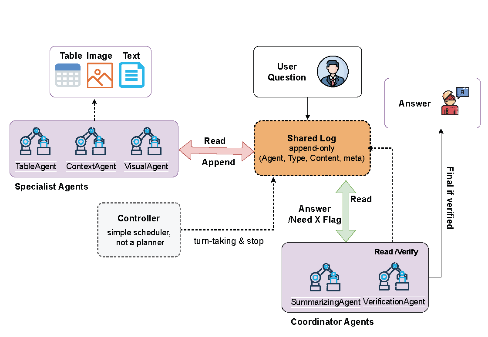

# Adaptive Chain-of-Table Reasoning with OpenAI LLMs

## Directory structure:

```
adaptive-table-qa/
├── agents/
│   ├── table_agent.py
│   ├── context_agent.py
│   ├── calculation_agent.py
│   └── coordinator.py
├── data/
│   ├── tatqa/
│   ├── finqa/
│   └── tabfact/
├── prompts/
│   ├── chain_templates.md
│   └── demo_examples.json
├── lora_finetune.py
├── evaluate.py
├── scripts/
│   └── generate_synthetic_data.py
├── utils/
│   ├── table_ops.py
@@ -40,26 +39,26 @@ adaptive-table-qa/
```

# Adaptive Chain-of-Table QA
```
This repository implements a multi-agent reasoning framework to perform multi-hop question answering over tables (and optionally text) using OpenAI LLMs like `gpt-3.5-turbo`.
```
## Features
```
- Modular agents: TableAgent, ContextAgent, CalculationAgent, Coordinator
- Chain-of-Table reasoning steps
- Few-shot prompt templates
- Finetuning with LoRA
- Evaluation on FinQA, TabFact, TAT-QA, WikiTQ, FeTaQA
```

## Architecture Overview

The system follows a planner-free, log-mediated question answering workflow in which
multiple specialist agents collaborate through a shared append-only log. Each agent
reads prior entries, writes new observations, and hands off intermediate results to
other agents for synthesis and verification. A high-level coordinator ensures turn
taking while a summarizing verifier validates the final answer before it is returned
to the user.

For a detailed breakdown of the components and their interactions, see the
[architecture poster](docs/architecture_poster.md). The concrete log schema,
message types, and agent contracts live in the new
[shared log schema reference](docs/shared_log_schema.md).

## Datasets

- `tatqa` – Original Tabular And Text QA benchmark (default).
- `crtqa` / `crt-qa` – Compliance Readiness Tables QA. Compact dataset with curated CRT adoption tables and contextual passages.
- `multi_hop` / `multi-hop` – Synthetic 5–8 step operator chains for stressing arithmetic/multi-hop coordination.
- `finqa`, `mmqa_full`, `mmqa_text_table`, `wikitq`, `fetaqa` – drop JSON/JSONL splits under `data/<DatasetName>/<split>.json`. The loader ingests flat lists of QA samples, so you can preprocess HuggingFace exports or your own converters without changing code.
- For quick smoke tests, use `--limit 20` (or set `sample_limit` in `configs/planner_benchmarks.yaml`) to cap runs at twenty examples per dataset.
- For the FeTaQA factuality experiment (QAGS/BERTScore/Log-Groundedness + 100-example human eval), follow the playbook in [`docs/fetaqa_faithfulness.md`](docs/fetaqa_faithfulness.md). That note also contains the new table to insert after Table 2 in the paper.

Choose a dataset via `--dataset` when running `main.py`, `scripts/run_dealog.py`, or the benchmarking harness.

## Setup
```bash
pip install -r requirements.txt
```

### Configure environment variables
The project automatically loads `.env` via [`python-dotenv`](https://github.com/theskumar/python-dotenv).
Fill in the sample `.env` with your own credentials:

- `OPENAI_API_KEY`, `MISTRAL_API_TOKEN`
- `HF_API_TOKEN` (used for gated HuggingFace downloads)
- `OPENROUTER_API_KEY` (plus optional `OPENROUTER_BASE_URL`, `OPENROUTER_SITE_URL`, `OPENROUTER_APP_NAME`)
- Model choices such as `PRIMARY_MODEL_NAME`, `VISUAL_MODEL_NAME`, and `DEALOG_SUMMARIZER_MODEL`
- Local backend knobs:
  - `DEALOG_LLM_BACKEND=local` to force local Transformers inference (`auto` will choose local when no API key is set and a local model path is available)
  - `PRIMARY_MODEL_PATH` / `DEALOG_SUMMARIZER_MODEL_PATH` (supports HuggingFace cache roots like `.../models--org--name` and auto-selects the latest snapshot)
  - Optional GPU pinning for all DeALoG scripts: `DEALOG_CUDA_VISIBLE_DEVICES` (comma-separated ids, e.g., `0,2,3`)
- `TMPDIR=/mnt/achakr40` to keep runtime temp files under `/mnt/achakr40`
- Visual stack:
  - `VISUAL_CAPTION_MODEL` / `VISUAL_CAPTION_MODEL_PATH` (local BLIP‑2 directory)
  - `VISUAL_OCR_ENGINE` / `VISUAL_OCR_MODEL_DIR` (PaddleOCR cache folder)

### Prepare Mistral model
Clone the official inference repository and install its Python package:
```bash
scripts/setup_mistral_inference.sh
```

### Use OpenAI API
Install the `openai` package (already listed in `requirements.txt`) and set
your API key:
```bash
export OPENAI_API_KEY=<your-key>
```

### Use OpenRouter API
If you prefer routing calls through OpenRouter, export your key (or set it in
`.env`):
```bash
export OPENROUTER_API_KEY=<your-openrouter-key>
```
You can also override `OPENROUTER_BASE_URL` when hosting a proxy.
DeALoG’s summarizer/verifier pipeline relies on this credential (or `OPENAI_API_KEY`)
to call the backing LLM; without it the agent falls back to a heuristic that may be
less accurate.

### Use local Transformers backend
To run summarizer/verifier with local checkpoints instead of OpenRouter:
```bash
export DEALOG_LLM_BACKEND=local
export PRIMARY_MODEL_PATH=/path/to/models--org--name
export DEALOG_SUMMARIZER_MODEL_PATH=/path/to/models--org--name
```
If you point to a HuggingFace cache root (`models--org--name`), the client
automatically resolves the newest entry under `snapshots/`.

Run the pipeline with any supported OpenAI model, e.g. `gpt-3.5-turbo`:
```bash
python main.py --dataset tatqa --llm gpt-3.5-turbo
```


## Run Inference
```bash
python main.py --dataset tatqa --llm mistral-7b --visual-caption-model Salesforce/blip2-flan-t5-xl
# CRT-QA sample
python main.py --dataset crtqa --llm ${PRIMARY_MODEL_NAME} --visual-ocr-engine PaddleOCR
# Synthetic multi-hop split
python main.py --dataset multi_hop --llm mistral-7b --visual-caption-path ./models/blip2_flan_t5_xl
# Limit to 20 FinQA examples
python main.py --dataset finqa --llm ${PRIMARY_MODEL_NAME} --limit 20
```

To collect richer metrics (accuracy + per-example traces) for DeALoG and plug them
into the benchmarking harness:
```bash
python scripts/run_dealog.py \
  --dataset tatqa --split dev --llm ${PRIMARY_MODEL_NAME} \
  --results-file /mnt/achakr40/dealog_tatqa.json \
  --visual-caption-model ${VISUAL_CAPTION_MODEL} \
  --visual-caption-path ${VISUAL_CAPTION_MODEL_PATH} \
  --visual-ocr-engine ${VISUAL_OCR_ENGINE} \
  --visual-ocr-model-dir ${VISUAL_OCR_MODEL_DIR}
```

## Fine-tune
```bash
python lora_finetune.py --model mistralai/Mistral-7B-v0.1
```

## Evaluate
```bash
python evaluate.py lora_mistral --split dev
```

## Benchmark Planners

Use `configs/planner_benchmarks.yaml` to describe dataset splits and planner baselines
(CoT, ReAct, ReWOO, planner-based agent, and DeALoG across LLaMA‑3 8B/70B, Mistral 7B/24B,
and Qwen‑3 Medium/Large). Run the matrix—optionally in parallel—via:

```bash
# Preview commands
python scripts/run_benchmark_matrix.py --dry-run

# Execute with max concurrency (defaults to CPU count)
python scripts/run_benchmark_matrix.py --max-workers 6
```

Each YAML entry can override command templates, decoding hyper-parameters, models, and
environment variables so you can plug in custom planner implementations. The runner writes
logs to `benchmarks/results/<timestamp>/logs` and expects every command to emit a JSON
metrics file (path provided through `{metrics_path}` and the `BENCHMARK_METRICS_FILE`
environment variable). Populate the JSON with fields like `accuracy`, `per_example`,
`calls`, `tokens`, `latency_sec`, and `api_cost` so downstream analysis can mirror the
paper’s reporting.

After the runs finish, compute accuracy deltas, bootstrap 95 % CIs, and paired permutation
tests relative to the matched backbone’s CoT baseline:

```bash
python scripts/analyze_benchmarks.py benchmarks/results/<run>/results.jsonl --baseline cot
```

The script emits a Markdown table summarising dataset/backbone/system values—including the
latency and cost columns shown in Table 6 of the paper.

Reference drivers for the matrix live in `baselines/run_{cot,react,rewoo,planner}.py`
and `scripts/run_dealog.py`; feel free to swap them out with your full implementations
once you are ready to benchmark real LLM calls.

### Long-horizon Table-6 style run (+8192-token ablation)

Use the dedicated runner to reproduce the CRT-QA / Multi-Hop rows and add an
`8192` summarizer-token ablation column:

```bash
python scripts/run_table6_long_horizon.py \
  --llm ${PRIMARY_MODEL_NAME} \
  --summarizer-llm ${DEALOG_SUMMARIZER_MODEL} \
  --base-max-tokens 256 \
  --ablation-max-tokens 8192 \
  --max-rounds 10 \
  --output-dir benchmarks/results/table6_long_horizon
```

To pin this run to selected GPUs via `.env`, set:
`DEALOG_CUDA_VISIBLE_DEVICES=0,2,3`

It writes:
- `benchmarks/results/table6_long_horizon/table6_long_horizon.md`
- `benchmarks/results/table6_long_horizon/table6_long_horizon.json`

Required datasets for all rows:
- `data/CRTQA/crtqa_{train,dev,test}.json`
- `data/multi_hop_synthetic/multi_hop_{train,dev,test}.json`

### Table-6 aligned baseline runs (CoT / ReAct / ReWOO / Planner)

Use the baseline runner below to evaluate the same rows (`CRT-QA`, `Multi-Hop 5–6`,
`Multi-Hop 7–8`, `All`) for one or more baseline systems:

```bash
python scripts/run_table6_baselines.py \
  --llm ${PRIMARY_MODEL_NAME} \
  --systems cot,react,rewoo,planner,planner_replan \
  --split dev \
  --output-dir benchmarks/results/table6_baselines
```

To pin this run to selected GPUs via `.env`, set:
`DEALOG_CUDA_VISIBLE_DEVICES=0,2,3`

Optional flags:
- `--limit 20` for a quick smoke run.
- `--systems ... ,dealog` to include DeALoG in the same table.
- `--decoding '{"temperature":0.2,"max_new_tokens":512}'` for non-CoT baselines.

### Visual caption & OCR models
BLIP-2 FLAN-T5-XL weights are mirrored under `models/blip2_flan_t5_xl/`. PaddleOCR
assets (detector/recognizer/classifier) live under `models/paddleocr_cache/`.
Update `.env` if you relocate these folders or switch to different checkpoints.
